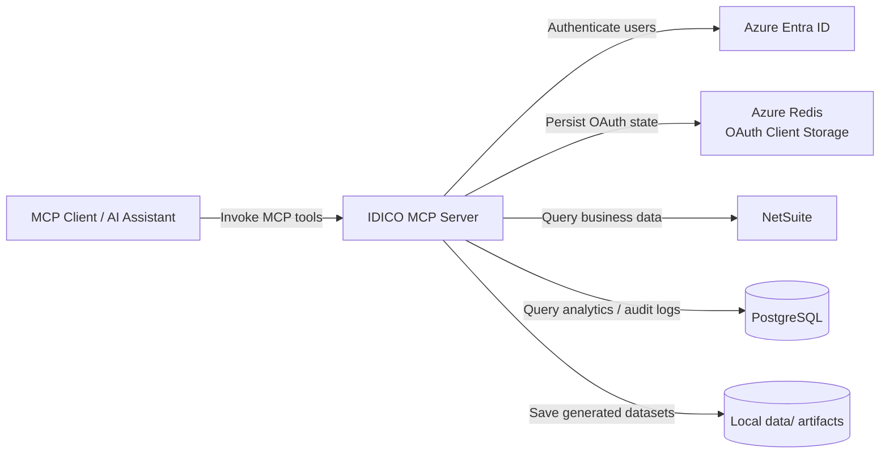
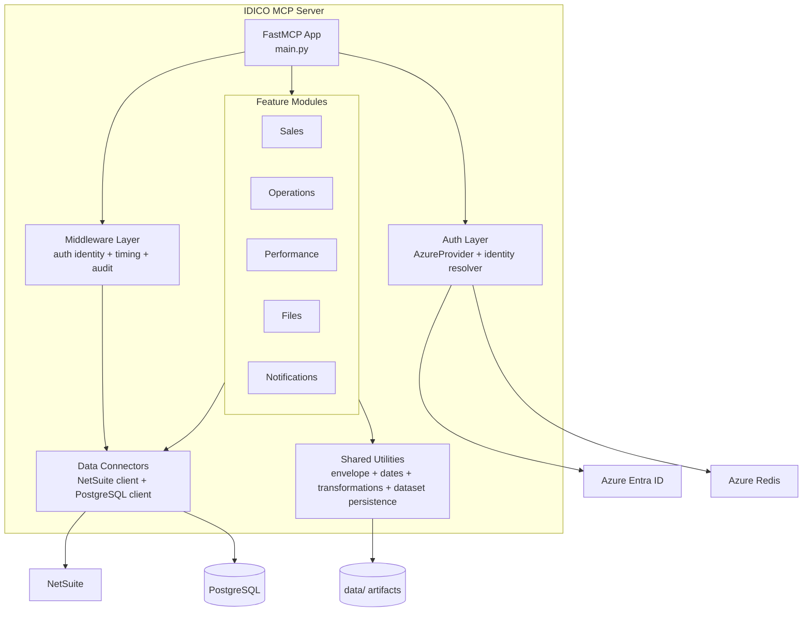
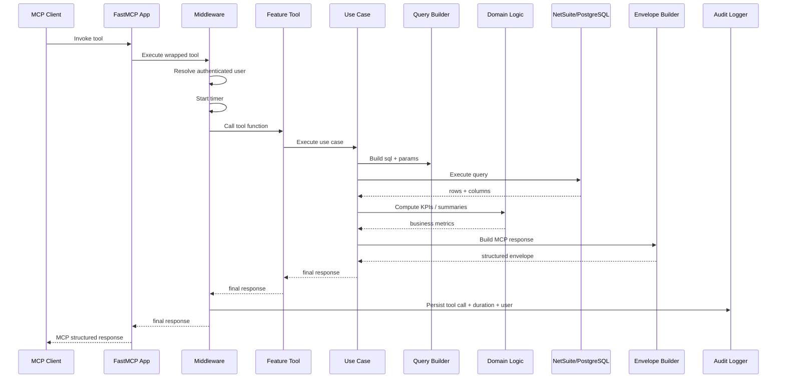
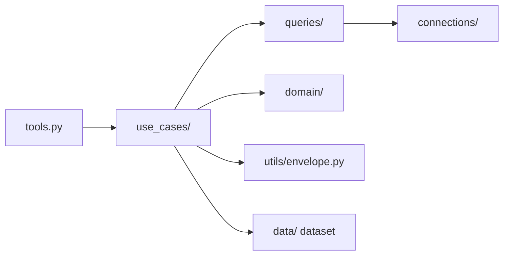

# MCP Server Architecture

This document shows the current architecture of the IDICO MCP Server using Mermaid diagrams grounded in the repository implementation.

## 1. System Context

## 2. Container Diagram

## 3. Request / Sequence Flow

## 4. Feature Internal Pattern

## Notes

- Main entrypoint: `main.py`
- Cross-cutting execution wrapper: `middleware.py`
- Auth provider: `auth/provider.py`
- Identity resolution: `auth/identity.py`
- Response contract: `utils/envelope.py`
- Main domain structure: `features/<domain>/{tools.py,use_cases/,queries/,domain/}`

## Current design risks

- `main_final.py` appears to be a legacy or duplicate entrypoint.
- `connections/netsuite/client.py` contains hardcoded token material and should be moved to secure secret management.
- PostgreSQL connector handles both data access and audit logging, which increases coupling.
